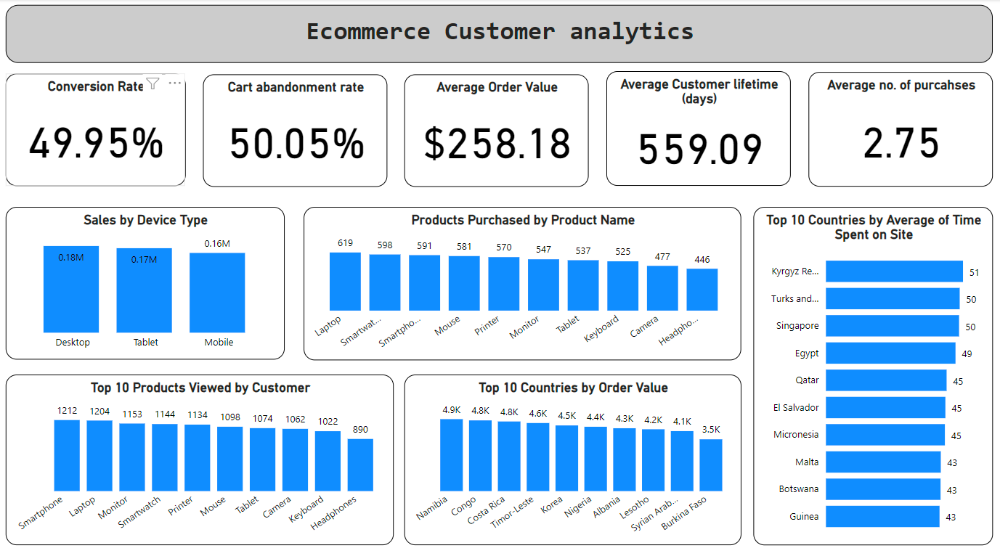

# E-Commerce Customer Analytics Dashboard

## Project Description

### Objective

The objective of this project is to create a comprehensive E-commerce Customer Analytics Dashboard that provides key insights into customer behavior, sales performance, and overall business health. Using synthetic data generated by the Faker library in Python, this project simulates an e-commerce platform's customer interactions to analyze and visualize key performance indicators (KPIs) such as Conversion Rate, Cart Abandonment Rate, Average Order Value, and Customer Lifetime Value.

### Stakeholders

- **E-commerce Business Owners**: To gain insights into customer behavior and optimize sales strategies.
- **Marketing Teams**: To identify top-selling products and understand customer demographics for targeted marketing campaigns.
- **Data Analysts**: To perform deep-dive analyses on customer data and generate actionable insights.
- **Product Managers**: To make data-driven decisions on product offerings and enhancements.
- **Recruiters**: To evaluate the candidate’s data analysis and visualization skills.

### Business Problem

In the competitive e-commerce landscape, understanding customer behavior and sales trends is crucial for making informed business decisions. However, many small and medium-sized businesses lack the tools and expertise to analyze their data effectively. This project aims to address this problem by providing a robust, easy-to-understand dashboard that can help businesses track their performance, identify opportunities for growth, and make data-driven decisions.

### Data and Methodology

- **Data Generation**: Using the Faker library, synthetic data for over 2000 customer interactions was generated, including customer demographics, device types, time spent on site, products viewed, products purchased, and cart abandonment instances.
- **Data Analysis**: Key metrics such as Conversion Rate, Cart Abandonment Rate, Average Order Value, and Customer Lifetime Value were calculated to provide a comprehensive view of the business performance.
- **Data Visualization**: Various charts and graphs were created to visualize sales by device type, average time spent on site, top-selling products, and customer geographic distribution.

### Results

- **Conversion Rate**: Insight into the percentage of visitors who complete a purchase, helping businesses understand the effectiveness of their sales funnel.
- **Cart Abandonment Rate**: Identification of potential issues in the checkout process that lead to lost sales.
- **Average Order Value**: Understanding of the average amount spent per transaction, aiding in revenue forecasting.
- **Customer Lifetime Value**: Estimation of the total revenue expected from a customer, helping in customer retention and value maximization strategies.

### Key Visualizations

- **Sales by Device Type**: Breakdown of total sales by device type (Desktop, Mobile, Tablet) to understand customer preferences and optimize the shopping experience.
- **Time Spent on Site**: Average time spent by customers on the site, broken down by city, to identify regions with higher engagement.
- **Top Selling Products**: List of the top 10 selling products to identify and promote popular items.
- **Customer Geographic Distribution**: Visualization of customer distribution by country to understand market reach and potential areas for expansion.

### Technologies Used

- **Python**: For data generation.
- **PowerBI**: For charts and calculation of metrics.
- **Faker**: For generating synthetic data.

### Conclusion

This E-commerce Customer Analytics Dashboard provides a powerful tool for e-commerce businesses to gain actionable insights from their data. By showcasing the ability to generate, analyze, and visualize data, this project demonstrates the potential to drive business growth through data-driven decision-making.

### How to Use

1. Clone the repository.
2. Install the required libraries.
3. Run the Python script to generate data and create the dashboard.
4. Analyze the generated visualizations to gain insights.

---

