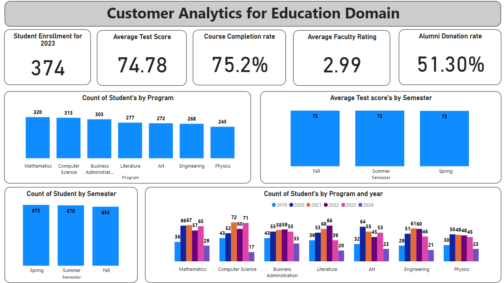

# Education Dashboard Project

## Objective
The objective of this project is to develop an interactive education dashboard using Python and Power BI to visualize key performance indicators (KPIs) and metrics that are essential for managing educational programs and enhancing student outcomes. The dashboard provides insights into student enrollment, course completion rates, average test scores, and alumni donation rates. It also includes visualizations for enrollment by program, semester-wise performance, faculty ratings, and alumni engagement.

## Stakeholders
- **University Administrators**: To monitor student performance and optimize program offerings.
- **Faculty Members**: To assess course completion rates and average test scores.
- **Alumni Relations Teams**: To track alumni donations and engagement.
- **Students and Parents**: To understand program popularity and academic performance trends.

## Business Problem
In the education sector, having real-time insights and detailed analysis of key metrics is crucial for effective program management and student success. Educational institutions often face challenges such as:
- **Monitoring Enrollment Trends**: Tracking student enrollment across different programs and semesters.
- **Improving Course Completion Rates**: Identifying factors that influence course completion and implementing improvement strategies.
- **Enhancing Test Scores**: Analyzing test scores to support academic excellence.
- **Engaging Alumni**: Increasing alumni engagement and donations to support the institution.

This project addresses these challenges by providing a comprehensive and interactive dashboard that consolidates all relevant educational data and visualizes it in an easily understandable format.

## Results
The dashboard successfully showcases the following:
- **Student Enrollment**: Visualization of student enrollment across different programs.
- **Course Completion Rate**: Analysis of course completion rates to identify areas for improvement.
- **Average Test Scores**: Calculation and visualization of average test scores by program and semester.
- **Individual Test Scores**: Tracking individual student test scores for detailed performance analysis.
- **Alumni Donation Rate**: Tracking of alumni donations to assess engagement and support.
- **Enrollment by Program**: Breakdown of student enrollment by program to inform resource allocation.
- **Semester-wise Performance**: Analysis of academic performance across different semesters.
- **Faculty Ratings**: Aggregation of faculty ratings to assess teaching effectiveness.
- **Alumni Engagement**: Visualization of alumni engagement scores to guide outreach efforts.
- **Course Completed**: A new metric to indicate the number of students who have completed their courses.

## Project Features
- **Data Generation**: Utilized Python and Faker library to generate synthetic educational data mimicking real-world scenarios.
- **Data Processing**: Performed data cleaning and transformation using pandas to prepare the data for analysis.
- **DAX Calculations**: Implemented various DAX measures and calculated columns in Power BI for KPI computation and visualization.
- **Interactive Dashboard**: Developed an interactive dashboard in Power BI that allows users to filter and drill down into specific metrics and visualizations.

## Technologies Used
- **Python**: For data generation, cleaning, and transformation.
- **Pandas**: For data manipulation and analysis.
- **Faker**: For generating synthetic data.
- **Power BI**: For creating interactive visualizations and dashboards.
- **DAX (Data Analysis Expressions)**: For calculating metrics and measures in Power BI.

## How to Use
1. Clone the repository.
2. Run the provided Python script to generate the synthetic dataset.
3. Load the dataset into Power BI.
4. Create the necessary measures and calculated columns using the provided DAX formulas.
5. Design the interactive dashboard using Power BI’s visualization tools.

## Conclusion
This project demonstrates the ability to integrate data science and business intelligence tools to create a powerful education dashboard. It showcases proficiency in Python for data processing and Power BI for visualization, making it a valuable addition to any educational management toolkit.

