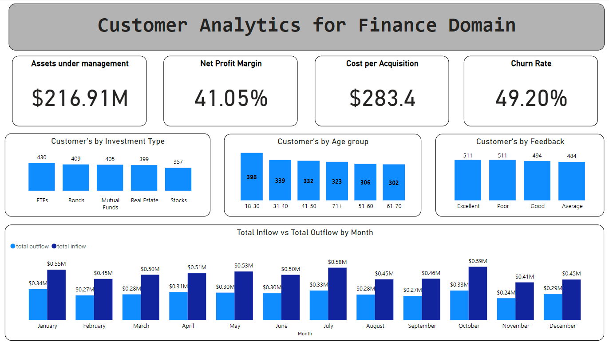

# Finance Dashboard Project

## Objective
The objective of this project is to develop an interactive finance dashboard using Python and Power BI to visualize key performance indicators (KPIs) and metrics that are essential for financial analysis and decision-making. The dashboard provides insights into assets under management, net profit margin, customer churn, and cost per acquisition. It also includes visualizations for investment types, monthly inflow vs. outflow, customer age groups, and customer feedback.

## Stakeholders
- **Financial Analysts**: To gain insights into financial performance and customer behavior.
- **Marketing Team**: To analyze the cost-effectiveness of customer acquisition strategies.
- **Management**: To make informed decisions based on financial data and customer metrics.
- **Investors**: To understand the financial health and performance metrics of the company.

## Business Problem
In the finance industry, having real-time insights and detailed analysis of financial metrics is crucial for making strategic decisions. Companies often struggle with:
- Tracking and optimizing assets under management.
- Understanding the net profit margin to evaluate profitability.
- Monitoring customer churn rates to improve retention strategies.
- Calculating the cost per acquisition to ensure efficient use of marketing budgets.
- Visualizing investment types, cash flows, and customer demographics to tailor financial products and services.

This project addresses these challenges by providing a comprehensive and interactive dashboard that consolidates all relevant financial data and visualizes it in an easily understandable format.

## Results
The dashboard successfully showcases the following:
- **Assets Under Management**: Visualization of total assets under management, helping stakeholders track the company's financial growth.
- **Net Profit Margin**: Analysis of the net profit margin to evaluate the company’s profitability over time.
- **Customer Churn**: Identification of churn rates, aiding in the development of customer retention strategies.
- **Cost Per Acquisition**: Calculation and visualization of the cost to acquire new customers, providing insights into the efficiency of marketing efforts.
- **Investment Types**: Breakdown of investments by type, allowing for better portfolio management.
- **Monthly Inflow vs. Outflow**: Visualization of cash flows to monitor financial health.
- **Customer Age Group**: Demographic analysis of customers, helping tailor products and services to different age groups.
- **Customer Feedback**: Aggregation of customer feedback to assess satisfaction and areas for improvement.

## Project Features
- **Data Generation**: Utilized Python and Faker library to generate a synthetic dataset that mimics real-world financial data.
- **Data Processing**: Performed data cleaning and transformation using pandas to prepare the data for analysis.
- **DAX Calculations**: Implemented various DAX measures and calculated columns in Power BI for KPI computation and visualization.
- **Interactive Dashboard**: Developed an interactive dashboard in Power BI that allows users to filter and drill down into specific metrics and visualizations.

## Technologies Used
- **Python**: For data generation, cleaning, and transformation.
- **Pandas**: For data manipulation and analysis.
- **Faker**: For generating synthetic data.
- **Power BI**: For creating interactive visualizations and dashboards.
- **DAX (Data Analysis Expressions)**: For calculating metrics and measures in Power BI.

## How to Use
1. Clone the repository.
2. Run the provided Python script to generate the synthetic dataset.
3. Load the dataset into Power BI.
4. Create the necessary measures and calculated columns using the provided DAX formulas.
5. Design the interactive dashboard using Power BI’s visualization tools.

## Conclusion
This project demonstrates the ability to integrate data science and business intelligence tools to create a powerful financial dashboard. It showcases proficiency in Python for data processing and Power BI for visualization, making it a valuable addition to any financial analysis toolkit.

