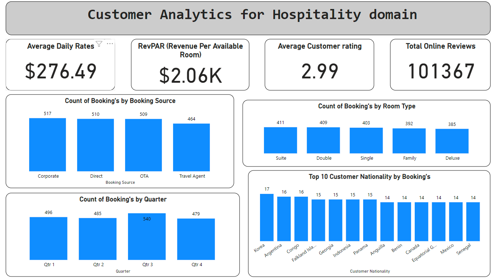

# Hospitality Dashboard Project

## Objective
The objective of this project is to develop an interactive hospitality dashboard using Python and Power BI to visualize key performance indicators (KPIs) and metrics that are essential for managing hotel operations and making data-driven decisions. The dashboard provides insights into average daily rate (ADR), revenue per available room (RevPAR), customer satisfaction, and online reviews. It also includes visualizations for booking sources, room type popularity, seasonal occupancy, and customer nationalities.

## Stakeholders
- **Hotel Managers**: To monitor hotel performance and optimize room rates and occupancy.
- **Revenue Managers**: To analyze revenue metrics and improve revenue management strategies.
- **Marketing Teams**: To understand booking sources and target marketing efforts effectively.
- **Customer Service Teams**: To assess customer satisfaction and address feedback.

## Business Problem
In the hospitality industry, having real-time insights and detailed analysis of key metrics is crucial for effective hotel management and competitive advantage. Hotels often face challenges such as:
- **Optimizing Room Rates**: Setting the right room rates to maximize revenue while maintaining high occupancy.
- **Revenue Management**: Tracking and improving revenue per available room.
- **Customer Feedback**: Understanding and responding to customer reviews and satisfaction ratings.
- **Booking Trends**: Analyzing booking sources and seasonal trends to optimize marketing strategies.

This project addresses these challenges by providing a comprehensive and interactive dashboard that consolidates all relevant hospitality data and visualizes it in an easily understandable format.

## Results
The dashboard successfully showcases the following:
- **Average Daily Rate (ADR)**: Calculation and visualization of the average daily rate across different room types and time periods.
- **RevPAR (Revenue per Available Room)**: Analysis of revenue per available room to evaluate the hotel's financial performance.
- **Customer Satisfaction**: Aggregation of customer satisfaction ratings to identify areas for improvement and enhance the guest experience.
- **Online Reviews**: Summarization of online reviews to monitor the hotel's online reputation.
- **Booking Sources**: Breakdown of bookings by source, helping to understand which channels are most effective.
- **Room Type Popularity**: Visualization of the popularity of different room types, aiding in inventory management.
- **Seasonal Occupancy**: Analysis of seasonal occupancy trends to inform pricing and marketing strategies.
- **Customer Nationalities**: Demographic analysis of guests to tailor services and marketing efforts.

## Project Features
- **Data Generation**: Utilized Python and Faker library to generate synthetic hospitality data mimicking real-world scenarios.
- **Data Processing**: Performed data cleaning and transformation using pandas to prepare the data for analysis.
- **DAX Calculations**: Implemented various DAX measures and calculated columns in Power BI for KPI computation and visualization.
- **Interactive Dashboard**: Developed an interactive dashboard in Power BI that allows users to filter and drill down into specific metrics and visualizations.

## Technologies Used
- **Python**: For data generation, cleaning, and transformation.
- **Pandas**: For data manipulation and analysis.
- **Faker**: For generating synthetic data.
- **Power BI**: For creating interactive visualizations and dashboards.
- **DAX (Data Analysis Expressions)**: For calculating metrics and measures in Power BI.

## How to Use
1. Clone the repository.
2. Run the provided Python script to generate the synthetic dataset.
3. Load the dataset into Power BI.
4. Create the necessary measures and calculated columns using the provided DAX formulas.
5. Design the interactive dashboard using Power BI’s visualization tools.

## Conclusion
This project demonstrates the ability to integrate data science and business intelligence tools to create a powerful hospitality dashboard. It showcases proficiency in Python for data processing and Power BI for visualization, making it a valuable addition to any hospitality management toolkit.

