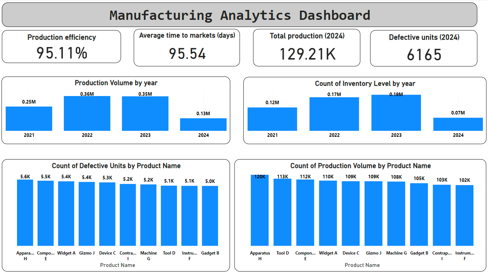

**Manufacturing Analytics Dashboard**

### Objective:
The objective of this project is to develop a comprehensive manufacturing analytics dashboard using Power BI. The dashboard aims to provide insights into key performance indicators (KPIs) and metrics in the manufacturing domain, enabling stakeholders to make data-driven decisions and optimize operational efficiency.

### Stakeholders:
1. **Manufacturing Managers**: Responsible for overseeing production operations and optimizing resource utilization.
2. **Quality Control Teams**: Ensure product quality standards are met and identify areas for improvement.
3. **Supply Chain Managers**: Manage inventory levels, supplier relationships, and logistics operations.
4. **Executive Leadership**: Utilize dashboard insights for strategic decision-making and resource allocation.

### Business Problem:
The manufacturing industry faces challenges related to production efficiency, quality control, inventory management, and supplier reliability. Traditional methods of data analysis often lack real-time visibility and fail to provide actionable insights. The business problem is to develop a solution that offers a holistic view of manufacturing operations and enables stakeholders to identify bottlenecks, optimize processes, and improve overall performance.

### Results:
1. **Improved Operational Efficiency**: Real-time monitoring of KPIs such as production efficiency and inventory turnover allows for proactive decision-making to optimize resource utilization and minimize waste.
2. **Enhanced Product Quality**: Quality control metrics enable early detection of defects, leading to improvements in product quality and customer satisfaction.
3. **Optimized Inventory Management**: Insights into inventory levels and supplier reliability help in maintaining optimal inventory levels, reducing stockouts, and minimizing inventory holding costs.
4. **Data-Driven Decision-Making**: Executive leadership can leverage dashboard insights to make informed decisions, allocate resources effectively, and drive strategic initiatives.

### Project Highlights:
- **Comprehensive Dashboard**: The dashboard provides a holistic view of manufacturing operations, integrating data from various sources to deliver actionable insights.
- **Interactive Visualizations**: Interactive charts and graphs enable users to drill down into specific metrics, filter data based on criteria, and gain deeper insights.
- **Scalability and Flexibility**: The solution is scalable and adaptable to accommodate evolving business needs and changing market dynamics.
- **User-Friendly Interface**: The dashboard features an intuitive and user-friendly interface, making it accessible to users across different levels of the organization.

### Conclusion:
The Manufacturing Analytics Dashboard empowers stakeholders with the tools and insights needed to drive operational excellence, improve product quality, and enhance overall competitiveness in the market. By harnessing the power of data analytics, organizations can unlock new opportunities for growth, innovation, and success in the manufacturing industry.