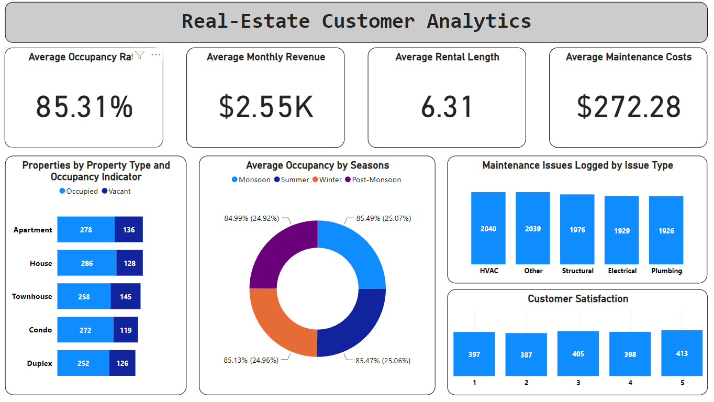

# Real Estate Dashboard Project

## Objective
The objective of this project is to develop an interactive real estate dashboard using Python and Power BI to visualize key performance indicators (KPIs) and metrics that are essential for real estate management and decision-making. The dashboard provides insights into occupancy rates, monthly revenue, average rental length, and maintenance costs. It also includes visualizations for occupancy by property type, seasonal occupancy rates, maintenance issues logged, and customer satisfaction.

## Stakeholders
- **Real Estate Managers**: To monitor property performance and optimize rental strategies.
- **Property Owners**: To track revenue, occupancy, and maintenance costs for investment properties.
- **Maintenance Teams**: To prioritize and address maintenance issues effectively.
- **Tenants**: To provide feedback on property satisfaction and rental experience.

## Business Problem
In the real estate industry, having real-time insights and detailed analysis of property metrics is crucial for effective property management and investment decisions. Companies often face challenges such as:
- **Optimizing Occupancy**: Maximizing occupancy rates to ensure steady rental income.
- **Revenue Management**: Monitoring monthly revenue and identifying factors affecting rental income.
- **Maintenance Planning**: Prioritizing maintenance tasks and controlling maintenance costs.
- **Tenant Satisfaction**: Understanding tenant feedback and improving overall satisfaction.

This project addresses these challenges by providing a comprehensive and interactive dashboard that consolidates all relevant real estate data and visualizes it in an easily understandable format.

## Results
The dashboard successfully showcases the following:
- **Occupancy Rates**: Visualization of occupancy rates across different properties and time periods.
- **Monthly Revenue**: Analysis of monthly rental revenue, allowing for revenue forecasting and optimization.
- **Average Rental Length**: Calculation of the average duration of tenant occupancy.
- **Maintenance Costs**: Tracking of maintenance costs and identification of cost-saving opportunities.
- **Occupancy by Property Type**: Breakdown of occupancy rates by property type, aiding in property portfolio management.
- **Seasonal Occupancy Rates**: Analysis of seasonal trends in occupancy rates to inform marketing and leasing strategies.
- **Maintenance Issues Logged**: Visualization of maintenance issues logged by type and frequency, facilitating efficient maintenance planning.
- **Customer Satisfaction**: Aggregation of tenant satisfaction ratings to identify areas for improvement and enhance tenant experience.

## Project Features
- **Data Generation**: Utilized Python and Faker library to generate synthetic real estate data mimicking real-world scenarios.
- **Data Processing**: Performed data cleaning and transformation using pandas to prepare the data for analysis.
- **DAX Calculations**: Implemented various DAX measures and calculated columns in Power BI for KPI computation and visualization.
- **Interactive Dashboard**: Developed an interactive dashboard in Power BI that allows users to filter and drill down into specific metrics and visualizations.

## Technologies Used
- **Python**: For data generation, cleaning, and transformation.
- **Pandas**: For data manipulation and analysis.
- **Faker**: For generating synthetic data.
- **Power BI**: For creating interactive visualizations and dashboards.
- **DAX (Data Analysis Expressions)**: For calculating metrics and measures in Power BI.

## How to Use
1. Clone the repository.
2. Run the provided Python script to generate the synthetic dataset.
3. Load the dataset into Power BI.
4. Create the necessary measures and calculated columns using the provided DAX formulas.
5. Design the interactive dashboard using Power BI’s visualization tools.

## Conclusion
This project demonstrates the ability to integrate data science and business intelligence tools to create a powerful real estate dashboard. It showcases proficiency in Python for data processing and Power BI for visualization, making it a valuable addition to any real estate management toolkit.

