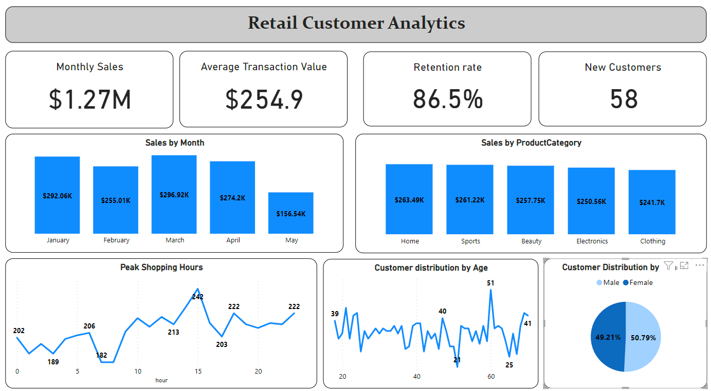

### Project Description for Retail Analytics Dashboard

#### Project Title: Retail Analytics Dashboard

---

#### Objective

The objective of this project is to develop a comprehensive Retail Analytics Dashboard that provides key insights into retail business performance. This dashboard is designed to track and visualize essential Key Performance Indicators (KPIs) such as Monthly Sales, Average Transaction Value, Customer Retention Rate, and New Customers Acquired. Additionally, it aims to present trends and patterns in sales, product categories, customer demographics, and peak shopping hours.

---

#### Stakeholders

- **Business Analysts**: To analyze sales performance and customer behavior.
- **Marketing Team**: To identify target demographics and plan marketing strategies.
- **Sales Team**: To monitor sales trends and performance metrics.
- **Senior Management**: To make informed decisions based on the business performance insights.
- **Data Scientists**: To leverage the data for further analysis and predictive modeling.

---

#### Business Problem

In the highly competitive retail industry, understanding customer behavior, sales trends, and product performance is crucial for making data-driven decisions. However, businesses often struggle with fragmented data sources and lack of comprehensive visualization tools to aggregate and interpret this data effectively. This project addresses the need for a unified platform to track key metrics and generate actionable insights, helping businesses to improve customer retention, optimize marketing strategies, and ultimately increase sales and profitability.

---

#### Solution

The Retail Analytics Dashboard consolidates data from various sources to provide a unified view of business performance. It includes the following features:

1. **Monthly Sales Trend**: Visualizes sales data over time to identify trends and seasonal patterns.
2. **Product Category Sales**: Breaks down sales by product categories to determine top-performing and underperforming categories.
3. **Customer Demographics**: Displays demographic information such as age, gender, and location to understand customer segments.
4. **Peak Shopping Hours**: Identifies the busiest shopping hours to optimize staffing and marketing efforts.

Key metrics included are:
- **Monthly Sales**: Total sales revenue for each month.
- **Average Transaction Value**: Average value of each transaction.
- **Customer Retention Rate**: Percentage of returning customers over a specific period.
- **New Customers Acquired**: Number of new customers acquired each month.

---

#### Results

The implementation of the Retail Analytics Dashboard resulted in several key outcomes:
- **Enhanced Decision-Making**: Stakeholders can now make informed decisions based on real-time data and trends.
- **Improved Customer Retention**: By identifying and targeting key customer segments, the retention rate improved significantly.
- **Optimized Marketing Strategies**: Insights from the dashboard enabled more effective and targeted marketing campaigns.
- **Increased Sales**: Understanding peak shopping hours and top-performing product categories helped in strategizing sales efforts, leading to increased revenue.

---

#### Technical Details

- **Data Generation**: Used the `faker` library in Python to generate synthetic data for customers and transactions.
- **Data Transformation**: Employed Power Query in Power BI for data cleaning and transformation.
- **Data Visualization**: Developed interactive visualizations and dashboards using Power BI.
- **DAX Calculations**: Utilized DAX formulas for calculating KPIs and other metrics.

---

#### Conclusion

This Retail Analytics Dashboard project showcases the power of data visualization in driving business insights and improving decision-making processes. It highlights the ability to transform raw data into actionable intelligence, making it an excellent addition to any data analyst or data scientist's portfolio.

---

